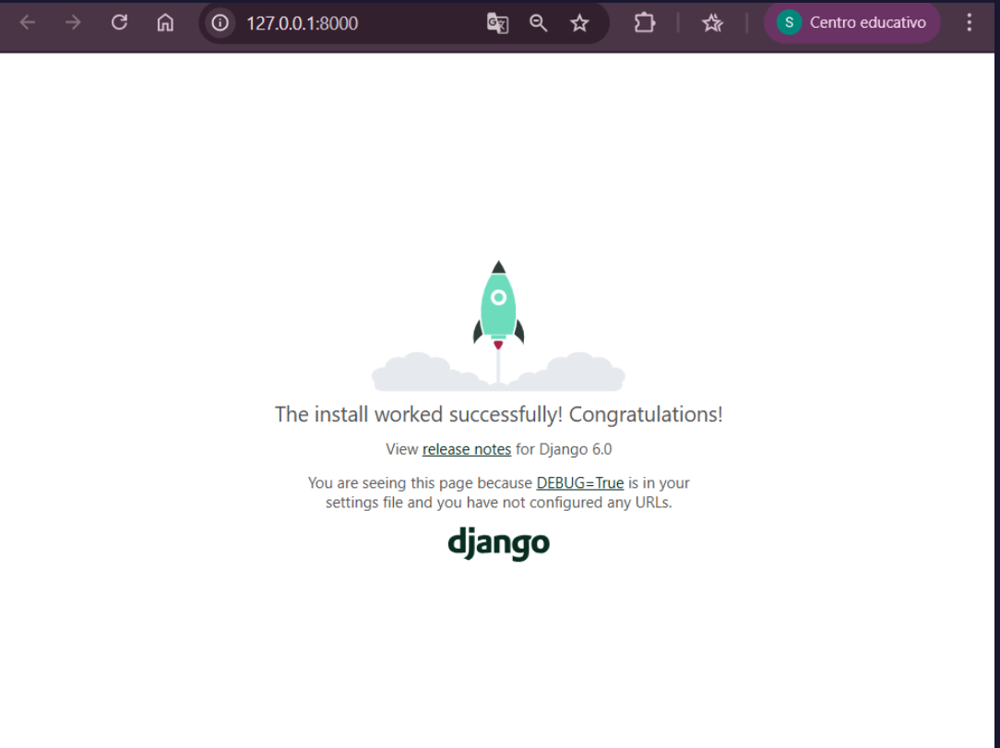
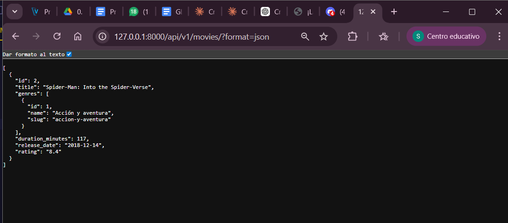
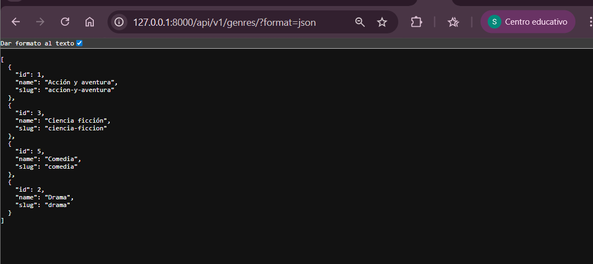
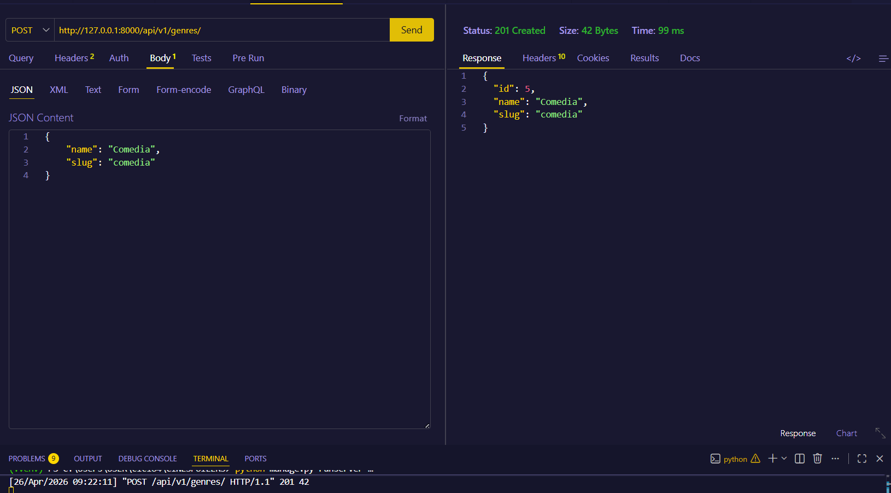
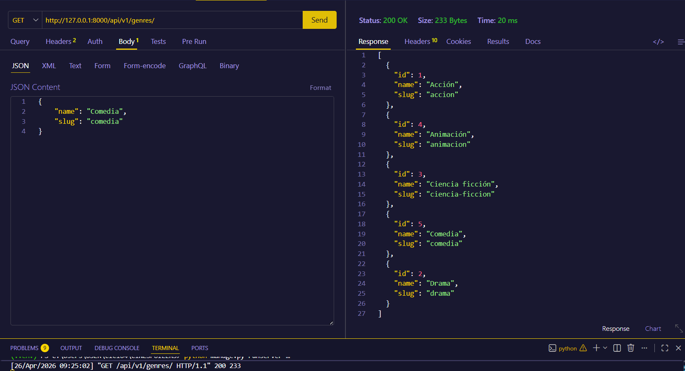
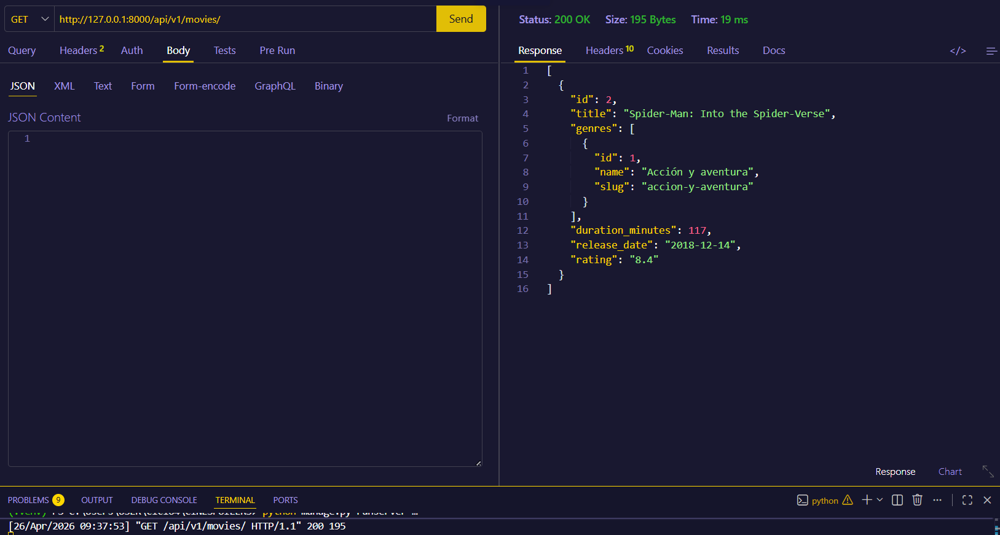
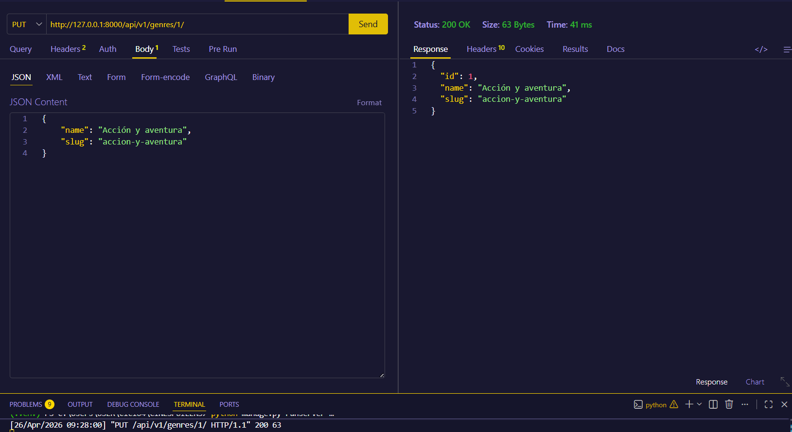
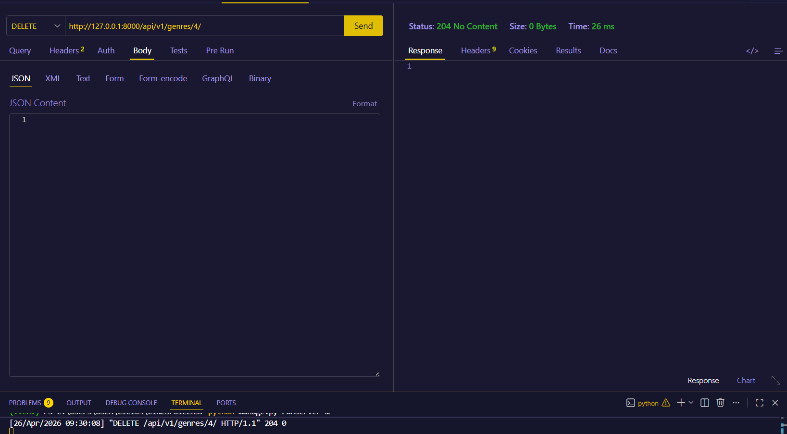

### Laboratorio 07
### Chuco Bravo Sheyla 
### 1)Levantamos la aplicación:

### 2)Corremos la aplicación de Movies 

### 2)Corremos la aplicación de Movies relacionado con género

### 3)Mostramos los Generos 

## 🔗 Endpoints de la API
### ✅ POST — Crear Género

### ✅ GET — Listar Géneros

### ✅ GET — Listar Peliculas con Género

### ✅ PUT — Actualizar genero

### ✅ DELETE — Eliminar genero

