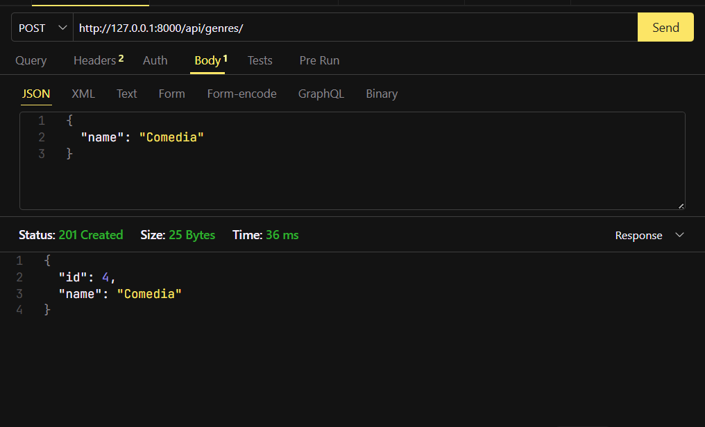
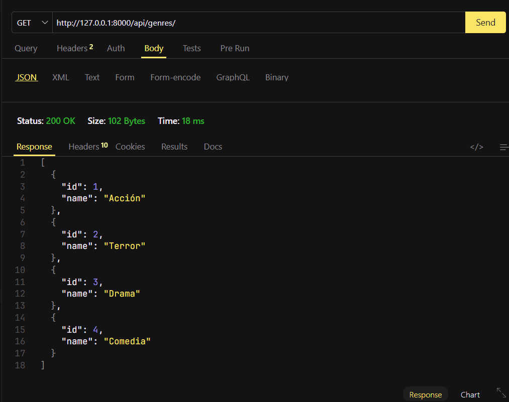
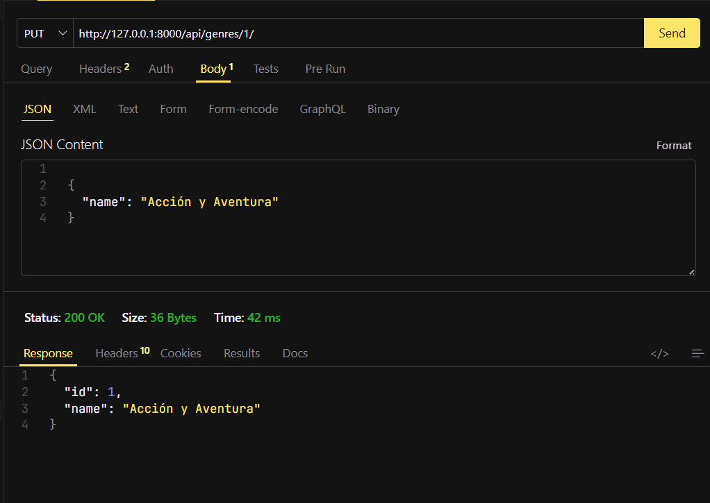
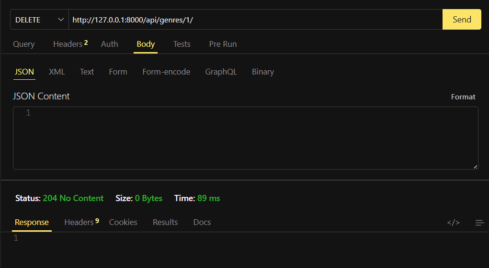
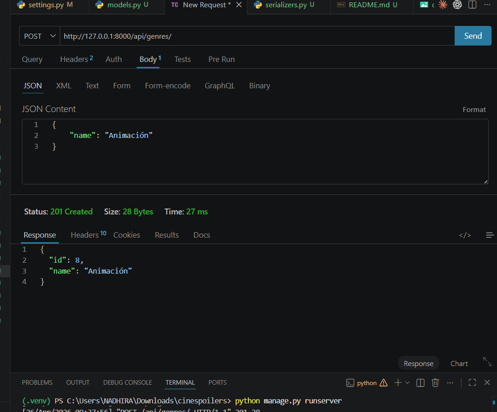
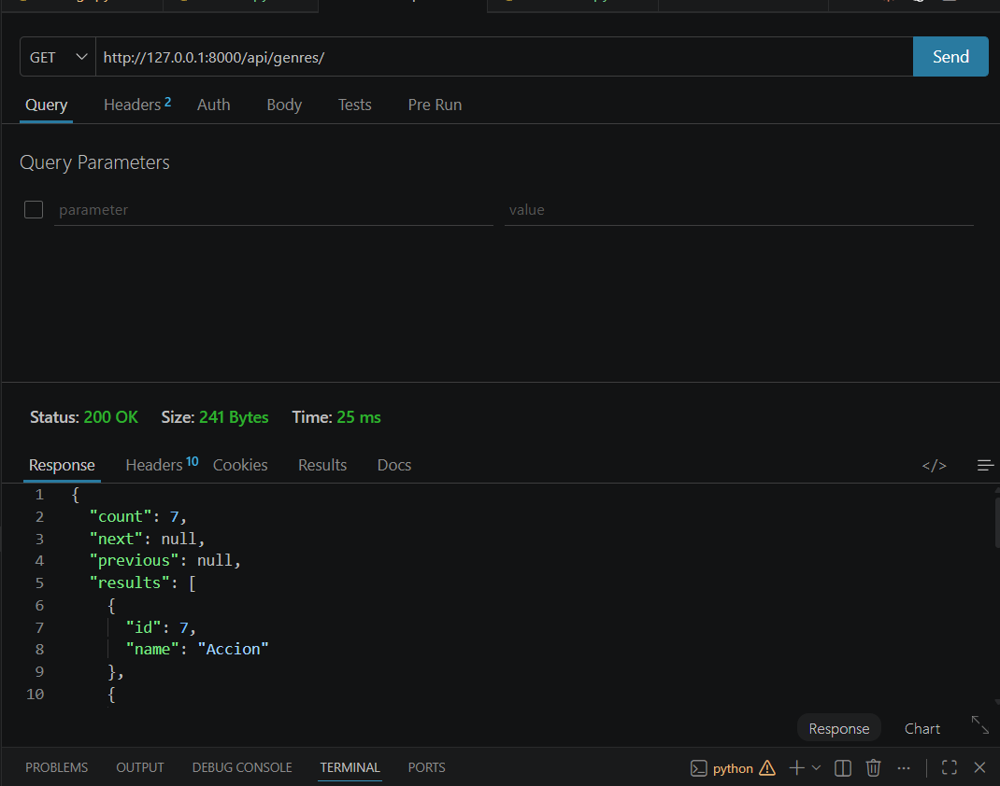
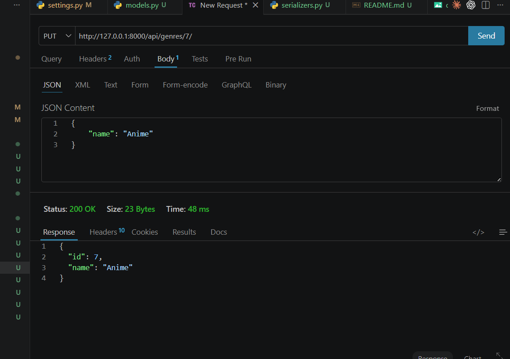
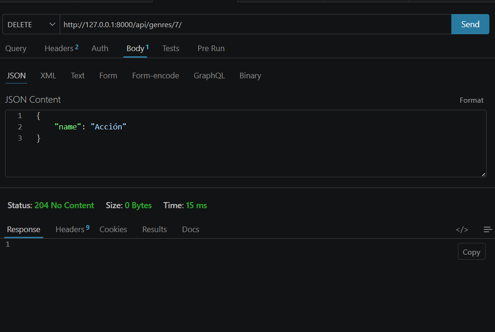

### Laboratorio 06
### 1)Chuco Bravo Sheyla 
## 🔗 Endpoints de la API
### ✅ POST — Crear Género

### ✅ GET — Listar Géneros

### ✅ GET — Listar Peliculas con Género

### ✅ PUT — Actualizar genero

### ✅ DELETE — Eliminar genero

### 1)Yakeli Jimenez
## 🔗 Endpoints de la API
### ✅ POST — Crear Género

### ✅ GET — Listar Géneros

### ✅ PUT — Actualizar genero

### ✅ DELETE — Eliminar genero

### 1)Atanacio Nadhira
## 🔗 Endpoints de la API
### ✅ POST — Crear Género

### ✅ GET — Listar Géneros

### ✅ PUT — Actualizar genero

### ✅ DELETE — Eliminar genero

